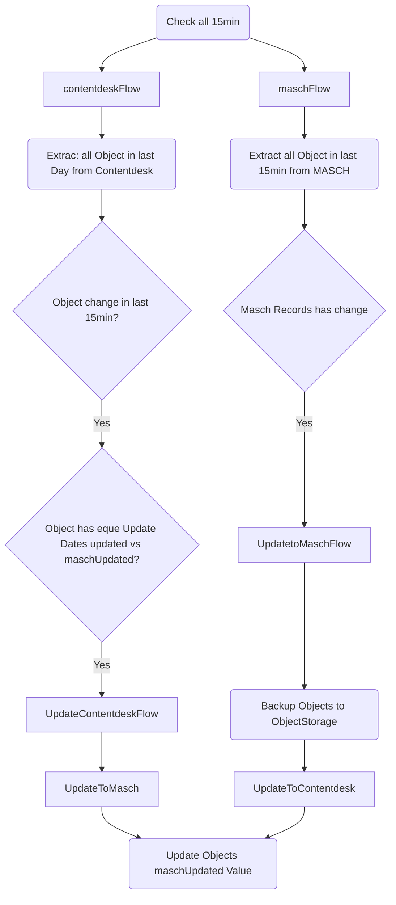

# Flow Chart

```mermaid
flowchart TD
    check(Check all 15min) --> contentdeskFlow
    check --> maschFlow

    contentdeskFlow --> ExtractContentdesk(Extrac: all Object in last Day from Contentdesk)
    ExtractContentdesk --> ObjectChangeLast5min{Object change in last 15min?}
    ObjectChangeLast5min --> |Yes| OBjectHasEqualDate{Object has eque Update Dates updated vs maschUpdated?}
    OBjectHasEqualDate --> |Yes| UpdateContentdeskFlow
    UpdateContentdeskFlow --> UpdateToMasch
    UpdateToMasch --> UpdateMaschUpdatedDateToContentdesk(Update Objects maschUpdated Value)

    maschFlow --> ExtractMasch(Extract all Object in last 15min from MASCH)
    ExtractMasch --> ObjectMaschChange{Masch Records has change}
    ObjectMaschChange --> |Yes| UpdatetoMaschFlow
    UpdatetoMaschFlow --> BackupObjectContentdesk(Backup Objects to ObjectStorage)
    BackupObjectContentdesk --> UpdateToContentdesk
    UpdateToContentdesk --> UpdateMaschUpdatedDateToContentdesk
```