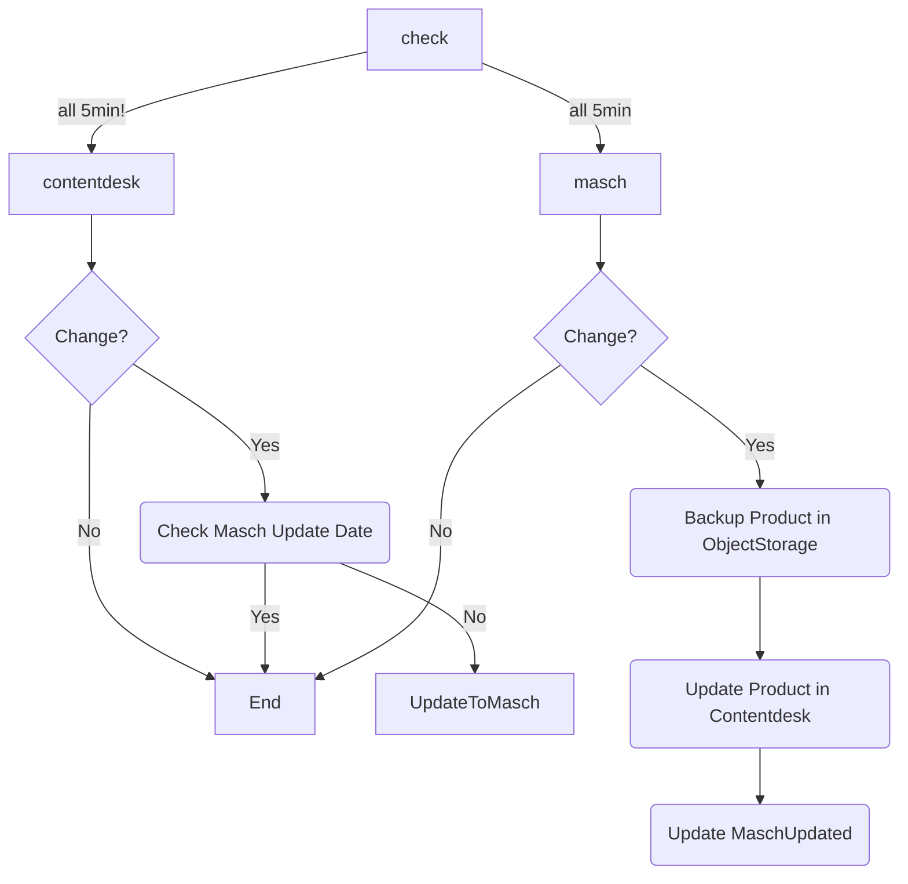

# Flow Chart

```mermaid
flowchart TD
    check -->|all 5min| masch
    check -->|all 5min!| contentdesk
    ChangeContentdesk -->|Yes| CheckifFromMaschCheck(Check Masch Update Date)
    ChangeContentdesk -->|No| End
    CheckifFromMaschCheck -->|Yes| End
    CheckifFromMaschCheck -->|No| UpdateToMasch
    masch --> ChangeMasch{Change?}
    contentdesk --> ChangeContentdesk{Change?}
    ChangeMasch -->|Yes| BackupContentdesk(Backup Product in ObjectStorage)
    ChangeMasch -->|No| End
    BackupContentdesk --> UpdateProductContentdesk(Update Product in Contentdesk)
    UpdateProductContentdesk --> SetFromMaschCheck(Update MaschUpdated)
```