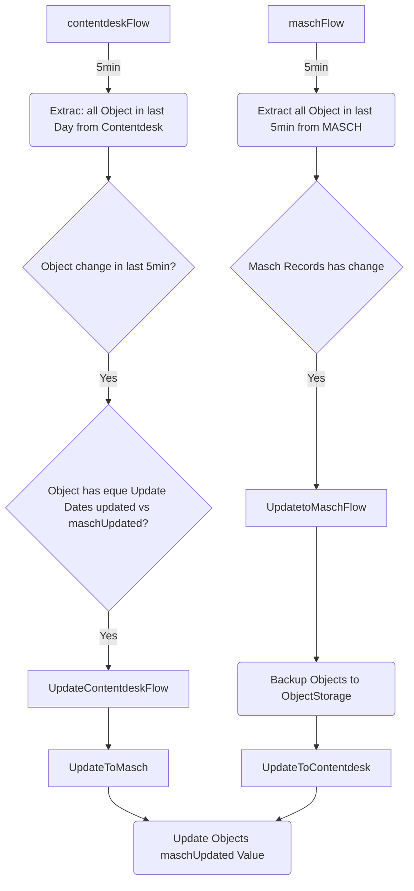

# Flow Chart

```mermaid
flowchart TD
    contentdeskFlow -->|5min| ExtractContentdesk(Extrac: all Object in last Day from Contentdesk)
    ExtractContentdesk --> ObjectChangeLast5min{Object change in last 5min?}
    ObjectChangeLast5min --> |Yes| OBjectHasEqualDate{Object has eque Update Dates updated vs maschUpdated?}
    OBjectHasEqualDate --> |Yes| UpdateContentdeskFlow
    UpdateContentdeskFlow --> UpdateToMasch
    UpdateToMasch --> UpdateMaschUpdatedDateToContentdesk(Update Objects maschUpdated Value)

    maschFlow --> |5min| ExtractMasch(Extract all Object in last 5min from MASCH)
    ExtractMasch --> ObjectMaschChange{Masch Records has change}
    ObjectMaschChange --> |Yes| UpdatetoMaschFlow
    UpdatetoMaschFlow --> BackupObjectContentdesk(Backup Objects to ObjectStorage)
    BackupObjectContentdesk --> UpdateToContentdesk
    UpdateToContentdesk --> UpdateMaschUpdatedDateToContentdesk
```