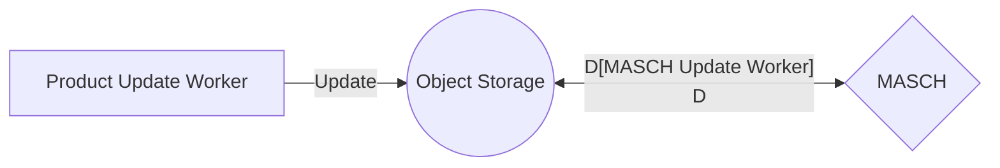
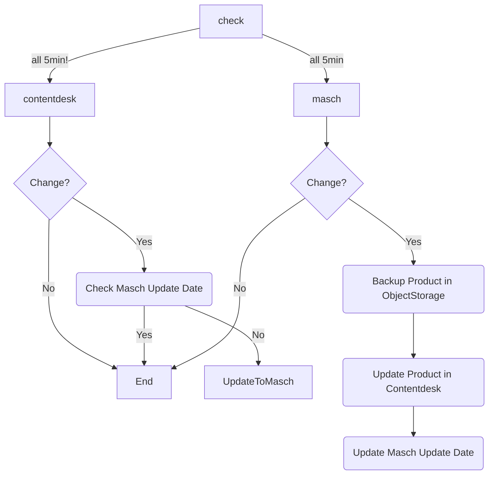

## Update List

Product Update List
https://sos-ch-dk-2.exo.io/ziggypimtsoch/export/contentdesk/job/products/updates/index.json

MASCH Update List
https://sos-ch-dk-2.exo.io/ziggypimtsoch/export/contentdesk/job/masch/updates/index.json

# Flow Chart

# Flow Chart

